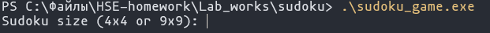
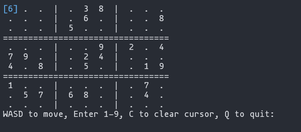
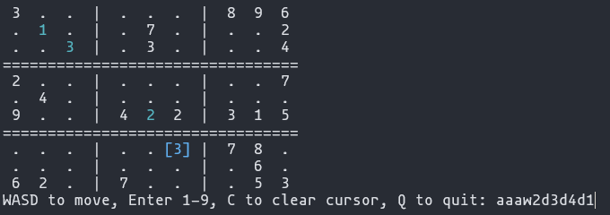
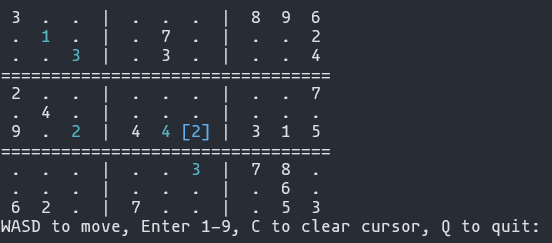
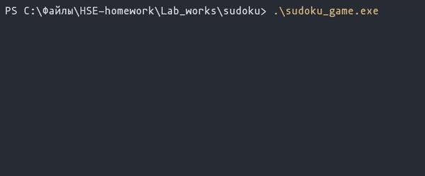
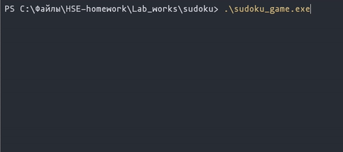
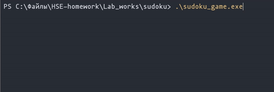
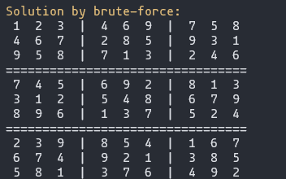

# Судоку на  C

## Навигация
- [**Инструкция по компиляции**](#Компиляция)
- [**Режим игры**](#Режим%20игры)
- [**Реализация**](#Реализация)
- [**Примеры**](#Примеры)
## Компиляция
**Для запуска проекта необходим какой-нибудь из компиляторов для языка Си (для примера используется GCC), чтобы скомпилировать, а затем и запустить проект с помощью команд ниже**
```
// Компиляция проекта
> gcc main.c

// Запуск игры
> ./a.exe // Windows
> ./a.out // Unix
```
## Режим игры
**При запуске игры программа запросит размер поля - 4x4 или 9x9, нужно ввести 4 или 9 соответственно, при вводе других чисел по умолчанию выберется режим 9x9**

**Затем программа сгенерирует уникальную судоку, причём для генерации используется метод брутфорса (брутфорс заполняет пустое поле, причём проверяя, чтобы такая судоку действительно могла существовать и быть решаемой), будет выбрана ячейка с координатами (0, 0)**

**Для взаимодействия с игрой нужно использовать следующее управление:**
- **WASD для перемещения по полю**
- **Выбирать цифры от 1 до 9**
- **C чтобы очистить курсор от выбранного игроком числа**
- **Q чтобы преждевременно выйти из игры**
**После выбора одной или ряда из нужных клавиш необходимо нажимать ENTER, игра обновит таблицу**
## Реализация
### Общие моменты
- **Игра работает полностью на *чистом C***
- **Интерфейс отображается *непосредственно в консоли***
- **Имеется *подсветка* некоторого текста, курсора, цифр игрока и правильность этих цифр, когда игрок заполнит все пустые места. Добавлено *больше* цветов, чем используется, поэтому при желании игрок может их поменять в коде игры, посмотреть цвета можно в соответствующем разделе `sudoku_all.h`**
- **Использование *псевдотипа* для определения размера поля `typedef unsigned int sudoku_size`**
- ***Размерность* поля задаётся пользователем при старте**
- **Используются *динамические массивы* и *указатели*. Корректное *выделение* и *освобождение* памяти**
- **Возможность для игрока подключить брутфорс в игру в `main.c` с помощью `#ifndef`**
- **Программа способна работать как на *Windows*, так и на *Unix* системах**
- **В заголовочном файле `sudoku_all.h` определены все функции, а также *псевдотипы***
- **При каждом новом вводе сетка полностью обновляется, что хоть и вызывает мерцание, однако гарантирует *100% работу* игры**

### Режим игры
- **В качестве курсора используются подсвеченные квадратные скобки `[ ]`**
- **Для сохранения интерактивности игрок может вводить совершенно любые числа в пустые поля, однако в конце игры при подведении результатов игра проверит все цифры игрока. Если обнаружены ошибки, в консоли выведется отдельное поле где будут помечены красным неправильные цифры и после игрок сможет заменять своё основное поле и видеть, подходит ли новое число или нет(оно будет подсвечиваться зелёным). Когда все цифры будут отмечены правильно, игра выведет поздравительно сообщение и отобразит повторно всё поле со всеми правильными цифрами**


### Режим брутфорса
- **Можно редактировать скорость выполнения**
- **Гарантировано найдёт решение, хотя из за особенностей брутфорса иногда это может занять время**

## Примеры
### Работа в режиме игры

 
 
 
### Работа в режиме брутфорса


 
